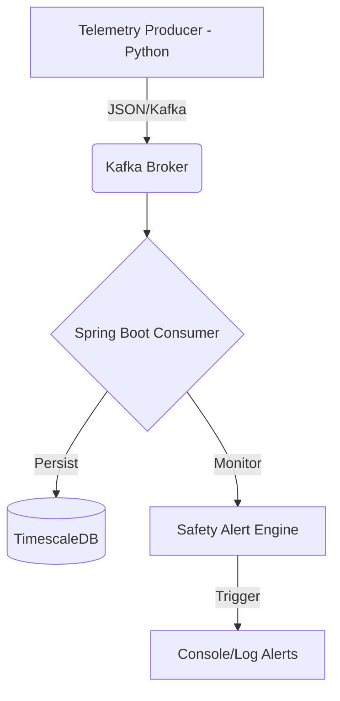

# FlightStream: Distributed Telemetry Mesh

A high-concurrency, event-driven backend built to simulate and monitor real-time aircraft telemetry. This project demonstrates enterprise-grade data ingestion, stream processing, and time-series storage.

## 1. Project Goal
The objective of this project is to build a resilient system capable of handling high-velocity data from 1,000+ simulated aircraft simultaneously. The focus is on **system reliability**, **real-time alerting**, and **modern Java concurrency**.

## 2. Success Criteria (Definition of Done)
* **Infrastructure Resilience:** System must process backlogged messages from Kafka without data loss after a consumer restart.
* **Real-Time Intelligence:** Automated detection of "Safety Events" (e.g., rapid altitude loss) within 500ms of ingestion.
* **Scalability:** Maintain stable performance under a load of 1,000 concurrent flight streams using Java 21 Virtual Threads.

## 3. System Architecture

---

# Architectural Decision Records (ADRs)

This document tracks the key technical decisions made during the development of **FlightStream**, the reasoning behind them, and the trade-offs involved.

---

## ADR 1: Event-Driven Architecture (Push vs. Pull)

### Status
**Accepted**

### Context
The system must monitor 1,000+ aircraft telemetry streams in real-time. We had to choose between a REST-based polling system (Pull) and an asynchronous event-driven system (Push).

### Decision
We will use an **Asynchronous Push model** utilizing **Apache Kafka** as the message broker.

### Consequences
* **Pros:** Decouples producers from consumers; ensures high availability; handles "bursty" data without crashing the backend.
* **Cons:** Increases infrastructure complexity (requires managing a Kafka cluster/Docker container).
* **Reasoning:** In a mission-critical domain like aviation, low latency is non-negotiable. A "Pull" model would create a bottleneck at the server level.

---

## ADR 2: Concurrency Model (Java 21 Virtual Threads)

### Status
**Accepted**

### Context
Processing 1,000+ simultaneous connections requires a highly efficient threading model. Traditional platform threads consume ~1MB of stack memory each.

### Decision
Utilize **Java 21 Virtual Threads (Project Loom)** for the Spring Boot consumer logic.

### Consequences
* **Pros:** Massive scalability on commodity hardware; simplified code compared to Reactive (WebFlux) programming.
* **Cons:** Requires the latest JDK; requires careful management of ThreadLocals.
* **Reasoning:** Virtual threads allow us to assign a dedicated "thread" to every flight stream for complex processing without exhausting system memory.

---

## ADR 3: Data Storage (Time-Series Database)

### Status
**Accepted**

### Context
Telemetry data is "append-only" and deeply tied to timestamps. Relational databases often struggle with index bloat and slow analytical queries on large time-stamped datasets.

### Decision
Use **TimescaleDB** (an extension of PostgreSQL).

### Consequences
* **Pros:** Maintains SQL compatibility (Postgres) while offering "Hypertables" for automatic time-based partitioning.
* **Cons:** Adds a specific dependency beyond standard PostgreSQL.
* **Reasoning:** TimescaleDB is optimized for the exact write-heavy patterns of flight tracking, allowing for fast historical lookups and real-time aggregations.

---

## ADR 4: Handling "Silent" Aircraft (Heartbeat Pattern)

### Status
**Proposed**

### Context
In real-world scenarios, aircraft may lose connectivity. The system needs to distinguish between a "healthy" gap in data and a "lost" connection.

### Decision
Implement a **Timeout/Heartbeat Monitor** using a distributed cache (Redis) or an in-memory state store.

### Consequences
* **Strategy:** If no message is received for a specific `flight_id` within 30 seconds, the system triggers a "Connection Lost" alert.
* **Reasoning:** This ensures that the dashboard doesn't show "stale" data as if it were live.

---

